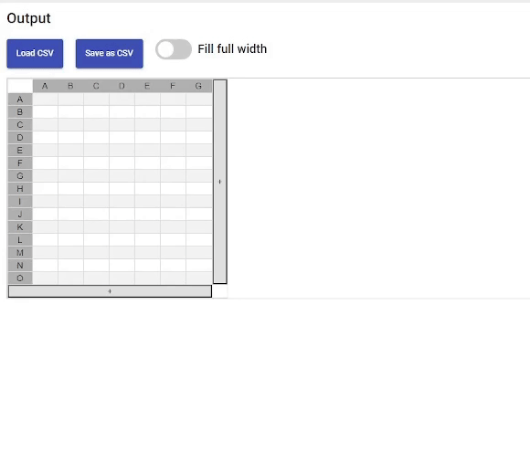
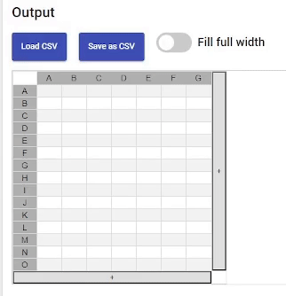
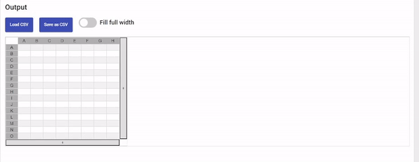
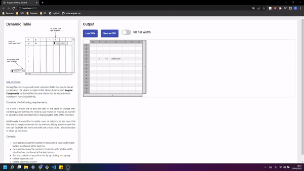
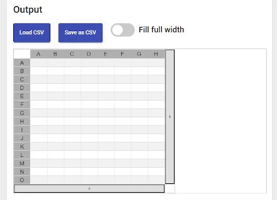

<h1 align="center">Welcome to Excel with Angular 👋</h1>
<p>
  
  <a href="#" target="_blank">
    
  </a>
  <a href="https://twitter.com/psurriel" target="_blank">
    
  </a>
</p>

> This is a little project limited only to the development of only one complex feature. This was my first step into Angular framework. I intended this as a challenge of 48h. At first, I did some courses in about 48h then developed this application in less than other 48h. I really liked Angular so much because of its closed file structure rules. I think it makes this technology quite scalable!

## Overview & user guide

### Add / Remove

  <li>
      Click on a row/column letter indicator > A dropdown menu will be shown > Select the "Delete row/column" option. 
  </li>
  <li>
      Click in the left "+" button to add a column.
  </li>
  <li>
      Click in the bottom "+" button to add a row.
  </li>



### Edit

Click over a cell and type to edit.
<ul>
<li>
    Press <span class="key-indicator">Tab</span> to edit the next (right) cell.
</li>

<li>
    Press <span class="key-indicator">Shift</span> + <span class="key-indicator">Tab</span> to edit the previous (left) cell.
</li>

<li>
    Press <span class="key-indicator">&#8593;</span> to edit the upper cell.
</li>


<li>
    Press <span class="key-indicator">&#8595;</span> to edit the bottom cell.
</li>
</ul>




### Full fill mode
  <p>
      <span style="font-weight: bolder;">IMPORTANT!!</span> Activating "fill full width" toggle AFTER editing column size will not work. This is because it's been designed to be activated or deactivated by default. The toggle button is a developer tool. If you want to activate this mode but you have edited some column size, refresh the page first. 
  </p>

  <li>
        Activate the toggle button to make let the table be full-filled.
  </li>

  <li>
      Due to aesthetics reasons, if there are too few columns, the table will not get fully filed. 
  </li>


### Load / Save

  <li>
      Press Save as CSV to download the file parsed to CSV format.
  </li>
  <li>
      Press Load CSV and select a file to fill the table with the content of the file.
  </li>



### Resize

Click at the edge of a column header and drag to edit column's width.

Yes, you can resize even when the table is overflowed!




## Install

```sh
yarn install
```

## Usage

```sh
yarn run start
```

## Run tests

```sh
yarn run test
```

## Author

👤 **Pol Surriel Muixench**

* Website: polsurriel.github.io
* Twitter: [@psurriel](https://twitter.com/psurriel)
* Github: [@PolSurriel](https://github.com/PolSurriel)
* LinkedIn: [@PolSurriel](https://linkedin.com/in/PolSurriel)

## Show your support

Give a ⭐️ if this project helped you!

***
_This README was generated with ❤️ by [readme-md-generator](https://github.com/kefranabg/readme-md-generator)_